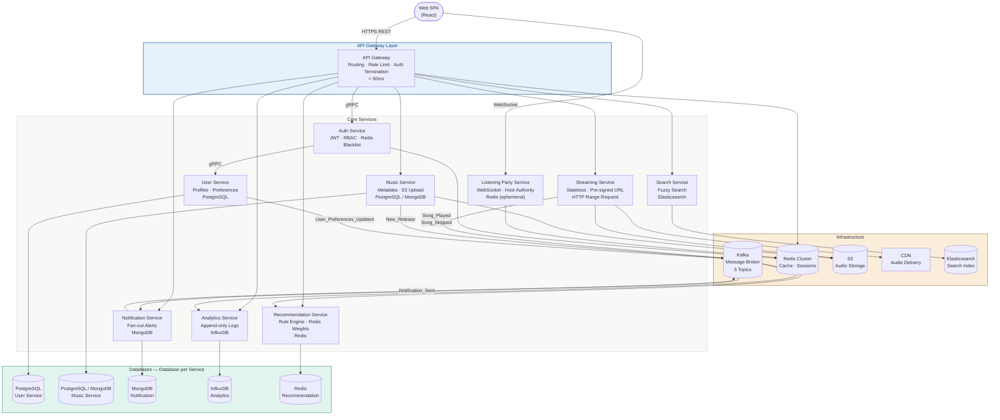
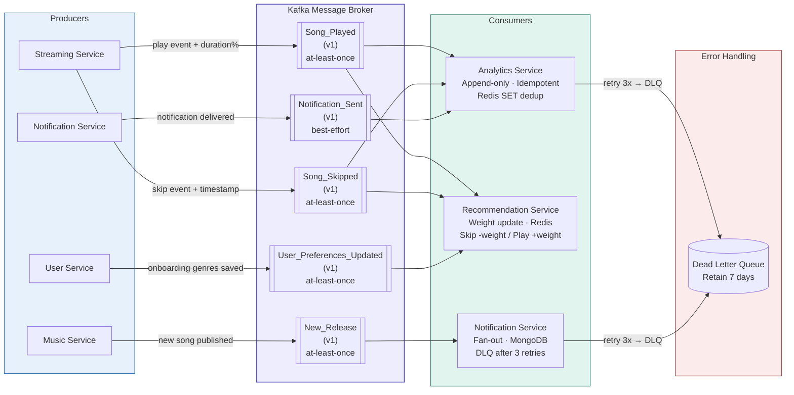
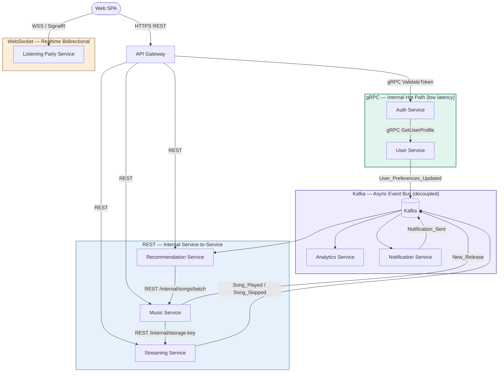
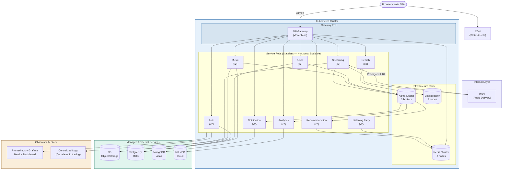

# System Architecture — Mermaid Diagrams
## Smart Music Streaming Platform | PRD V5 / Backlog V7

Paste từng block vào https://mermaid.live để preview và export PNG/SVG.

---

## Diagram 1 — System Architecture Overview



---

## Diagram 2 — Event-Driven Flow (Kafka)



---

## Diagram 3 — Internal Communication Patterns



---

## Diagram 4 — Deployment Architecture (Docker / Kubernetes)



---

## Ghi chú sử dụng

- **Mermaid Live Editor**: https://mermaid.live — paste code, export PNG/SVG
- **GitHub / GitLab**: wrap trong ` ```mermaid ``` ` trong Markdown file
- **Notion**: dùng block `/code` chọn ngôn ngữ `mermaid`
- **draw.io**: Import > từ Mermaid (File > Import from > Mermaid)
- **VS Code**: Extension "Mermaid Preview" hoặc "Markdown Preview Mermaid Support"

## Thứ tự đặt trong báo cáo

| Diagram | Chương | Vị trí |
|---|---|---|
| Diagram 1 — System Overview | Chương 1 — Tổng quan | Sau phần mô tả đề tài |
| Diagram 3 — Communication Patterns | Chương 2 — Cơ sở lý thuyết | Minh họa microservices patterns |
| Diagram 2 — Kafka Event Flow | Chương 2 — Cơ sở lý thuyết | Minh họa event-driven architecture |
| Diagram 4 — Deployment | Chương 2 — Cơ sở lý thuyết | Minh họa containerization / K8s |
