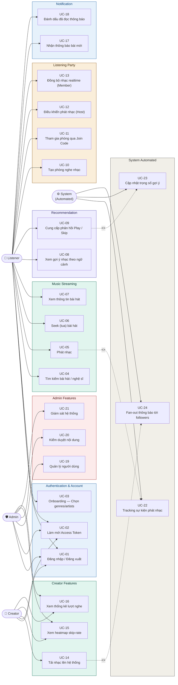

# Use Case Diagram — Mermaid Code
## Smart Music Streaming Platform | PRD V5 / Backlog V7

Paste vào https://mermaid.live để preview và export PNG/SVG.

---

---

## Danh sách 24 Use Cases

| ID | Tên | Actor chính | Epic |
|---|---|---|---|
| UC-01 | Đăng nhập / Đăng xuất | Listener, Creator, Admin | EPIC 1 |
| UC-02 | Làm mới Access Token | Listener, Creator, Admin | EPIC 1 |
| UC-03 | Onboarding — Chọn genres/artists | Listener | EPIC 1 |
| UC-04 | Tìm kiếm bài hát / nghệ sĩ | Listener | EPIC 5 |
| UC-05 | Phát nhạc | Listener | EPIC 3 |
| UC-06 | Seek (tua) bài hát | Listener | EPIC 3 |
| UC-07 | Xem thông tin bài hát | Listener, Creator | EPIC 3 |
| UC-08 | Xem gợi ý nhạc theo ngữ cảnh | Listener | EPIC 2 |
| UC-09 | Cung cấp phản hồi Play / Skip | Listener, System | EPIC 2 |
| UC-10 | Tạo phòng nghe nhạc | Listener (Host) | EPIC 7 |
| UC-11 | Tham gia phòng qua Join Code | Listener (Member) | EPIC 7 |
| UC-12 | Điều khiển phát nhạc (Host) | Listener (Host) | EPIC 7 |
| UC-13 | Đồng bộ nhạc realtime (Member) | Listener (Member) | EPIC 7 |
| UC-14 | Tải nhạc lên hệ thống | Creator | EPIC 1 |
| UC-15 | Xem heatmap skip-rate | Creator, Admin | EPIC 4 |
| UC-16 | Xem thống kê lượt nghe | Creator, Admin | EPIC 4 |
| UC-17 | Nhận thông báo bài mới | Listener | EPIC 6 |
| UC-18 | Đánh dấu đã đọc thông báo | Listener | EPIC 6 |
| UC-19 | Quản lý người dùng | Admin | EPIC 0 |
| UC-20 | Kiểm duyệt nội dung | Admin | PRD V5 |
| UC-21 | Giám sát hệ thống | Admin | PRD V5 |
| UC-22 | Tracking sự kiện phát nhạc | System | EPIC 4 |
| UC-23 | Cập nhật trọng số gợi ý | System | EPIC 2 |
| UC-24 | Fan-out thông báo tới followers | System | EPIC 6 |

## Ghi chú

- **<<include>>**: UC-05 include UC-22 (mỗi lần phát nhạc → tự động tracking)
- **<<include>>**: UC-09 include UC-23 (mỗi play/skip → tự động cập nhật weight)
- **<<include>>**: UC-14 include UC-24 (mỗi upload → tự động fan-out notification)
- Dùng Mermaid Live: https://mermaid.live
