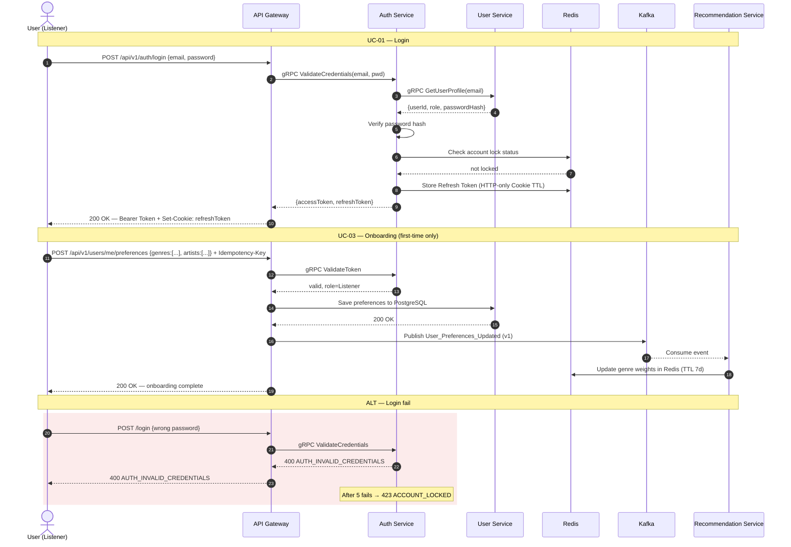
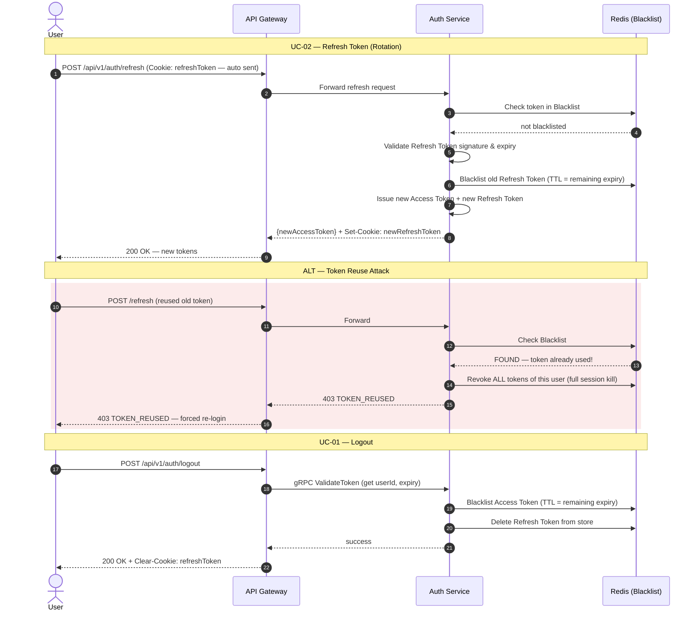
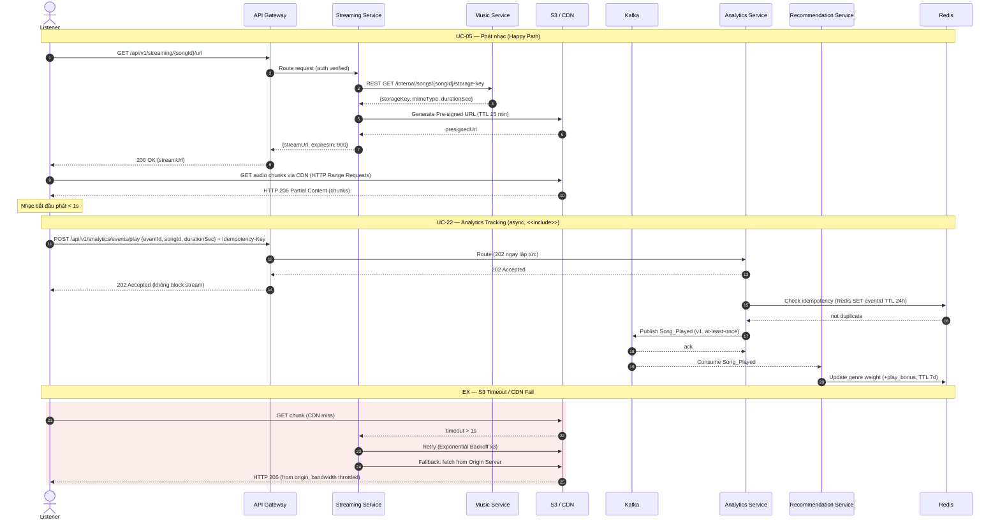
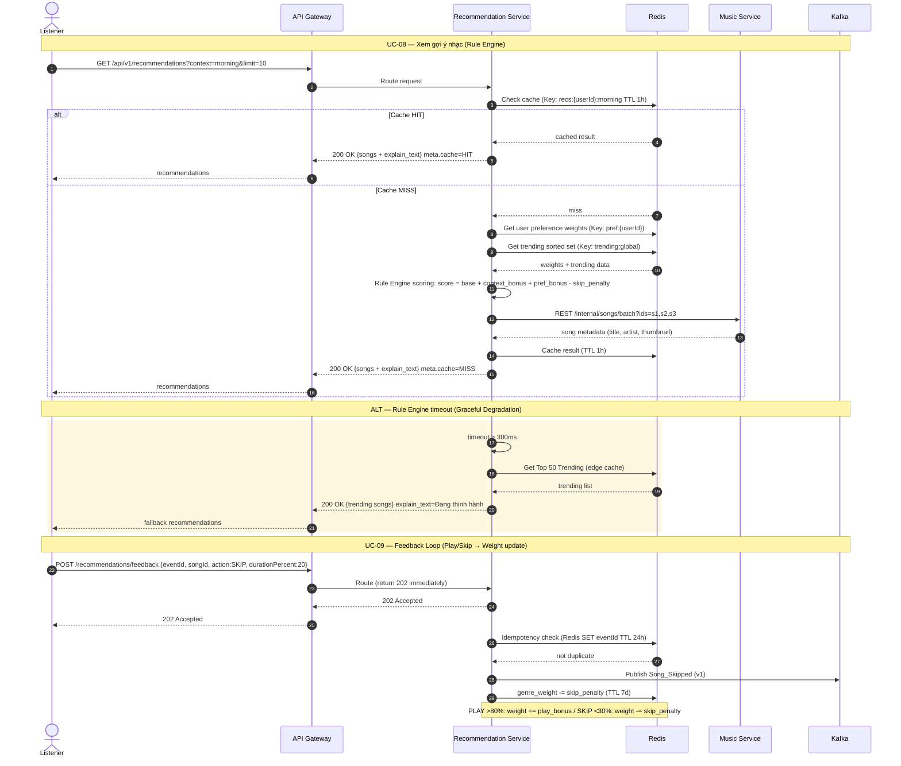
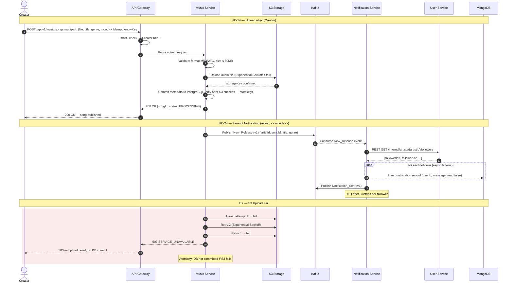
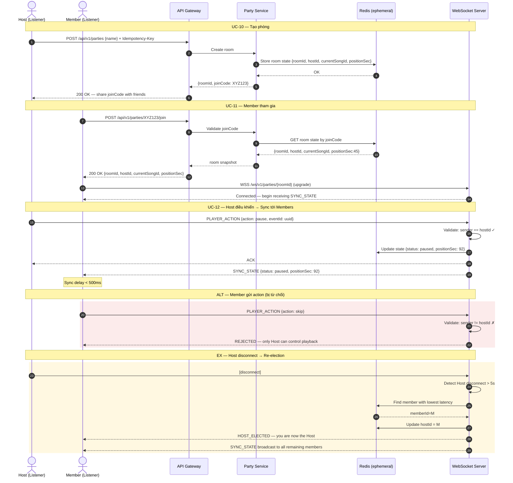
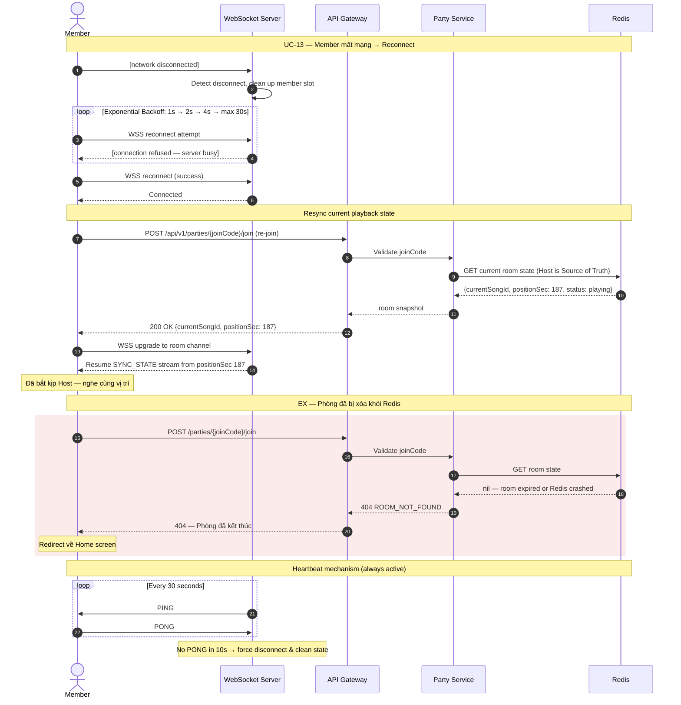
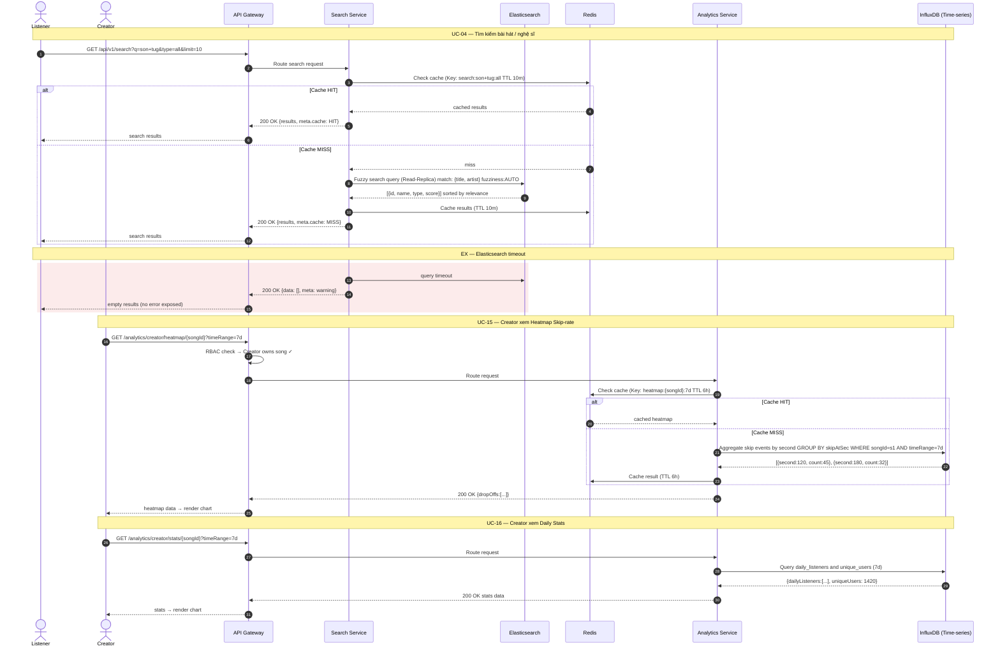
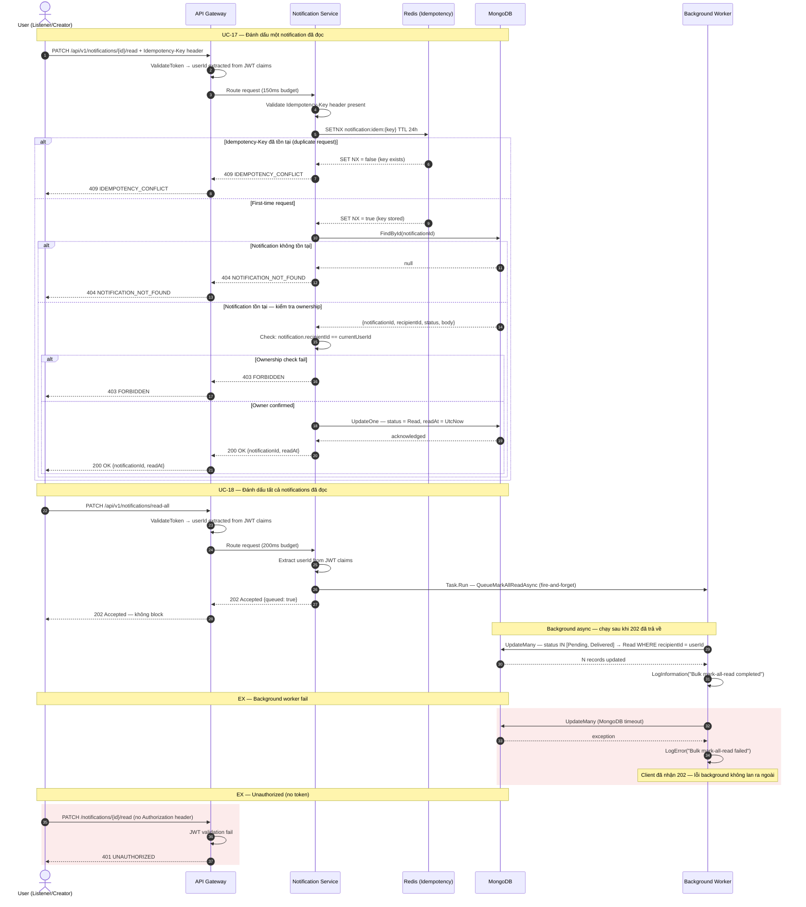
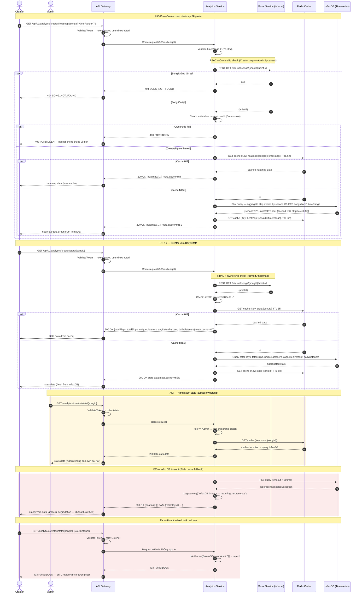

# Sequence Diagrams — Mermaid Code
## Smart Music Streaming Platform | PRD V5 / Backlog V7 / Use Case V1

Paste từng block vào https://mermaid.live để preview và export PNG/SVG.

---

## SD-01 — Login & Onboarding (UC-01, UC-03)



---

## SD-02 — Refresh Token & Logout (UC-02, UC-01)



---

## SD-03 — Phát nhạc + Analytics Tracking (UC-05, UC-22)



---

## SD-04 — Recommendation + Feedback Loop (UC-08, UC-09, UC-23)



---

## SD-05 — Music Upload + Notification Fan-out (UC-14, UC-24)



---

## SD-06 — Listening Party: Create, Join & Host Sync (UC-10, UC-11, UC-12)



---

## SD-07 — Member Reconnect & Resync (UC-13)



---

## SD-08 — Search + Creator Analytics Dashboard (UC-04, UC-15, UC-16)



---

---

## SD-09 — Notification Read & Mark-All (UC-17, UC-18)



---

## SD-10 — Creator Analytics Dashboard (UC-15, UC-16)



---

## Tổng hợp các luồng

| ID | Tên | UC liên quan | Actors |
|---|---|---|---|
| SD-01 | Login & Onboarding | UC-01, UC-03 | Listener, Creator, Admin |
| SD-02 | Refresh Token & Logout | UC-02, UC-01 | All users |
| SD-03 | Phát nhạc + Analytics | UC-05, UC-22 | Listener, System |
| SD-04 | Recommendation + Feedback | UC-08, UC-09, UC-23 | Listener, System |
| SD-05 | Music Upload + Notification | UC-14, UC-24 | Creator, System |
| SD-06 | Listening Party Create/Join/Sync | UC-10, UC-11, UC-12 | Host, Member |
| SD-07 | Party Reconnect & Resync | UC-13 | Member |
| SD-08 | Search + Creator Dashboard | UC-04, UC-15, UC-16 | Listener, Creator |
| SD-09 | Notification Read & Mark-All | UC-17, UC-18 | Listener, Creator |
| SD-10 | Creator Analytics Dashboard | UC-15, UC-16 | Creator, Admin |

## Ghi chú

- Dùng Mermaid Live: https://mermaid.live
- GitHub/GitLab: wrap trong ```mermaid``` block
- Tất cả luồng đều có: Happy Path, ALT (alternative), EX (exception/error)
- Các ký hiệu:
  - `-->>` : response (dashed)
  - `->>` : request (solid)
  - `rect rgb(252,235,235)` : error/exception scenario (đỏ nhạt)
  - `rect rgb(255,248,225)` : alternative/warning scenario (vàng nhạt)
  - `<<include>>` : use case inclusion relationship
